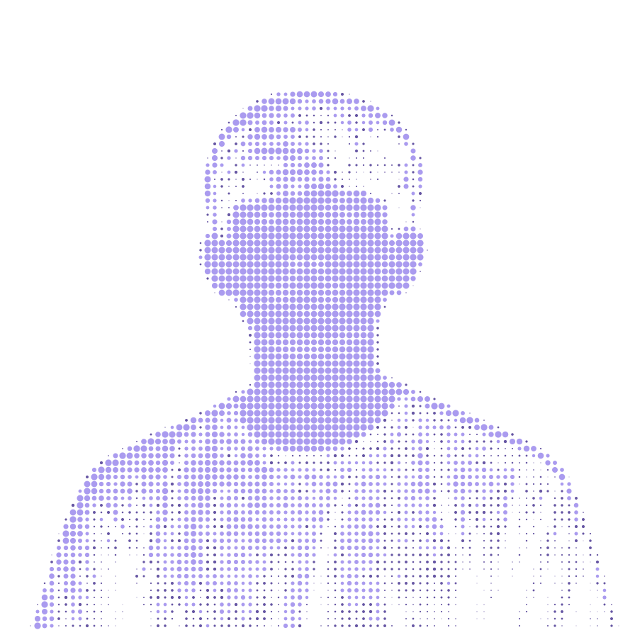
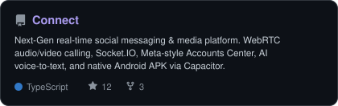
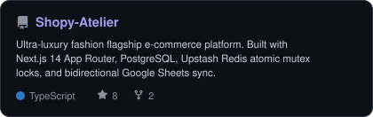
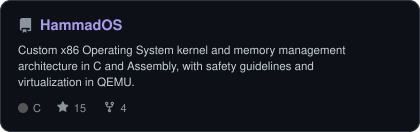
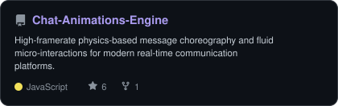
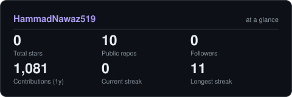

<!-- LIVE TERMINAL BANNER - profile.sh --live. Generated by scripts/banner/generate.py. -->
<picture>
  <source media="(prefers-color-scheme: dark)"  srcset="assets/banner-dark.v9.svg">
  <source media="(prefers-color-scheme: light)" srcset="assets/banner-light.v9.svg">
  
</picture>

 

<!-- NAME / TAGLINE - animated typing SVG -->

 

<!-- SOCIALS & LINKS -->
&nbsp;&nbsp;
&nbsp;&nbsp;
&nbsp;&nbsp;

  

---

<table>
<tr>
<td width="36%" align="center" valign="middle">

<!-- Dot-matrix Halftone Portrait - Generated by scripts/dotify.py from user photo -->
<picture>
  <source media="(prefers-color-scheme: dark)"  srcset="assets/portrait-dark.svg">
  <source media="(prefers-color-scheme: light)" srcset="assets/portrait-light.svg">
  
</picture>

</td>
<td width="64%" valign="top">

## This is me

I'm **Hammad Nawaz**, a full-stack software engineer from Pakistan. I build web platforms, real-time systems, and low-level software. Most of what I ship is fast, minimal, and actually works under pressure.

- **[Connect](https://myconnectapp.vercel.app)** — real-time communication platform with WebRTC video/audio calling, Socket.IO messaging, multi-account support, voice notes with speech-to-text, and an Android APK release.
- **[SHOPY Atelier](https://buyatshopy.vercel.app)** — a luxury fashion e-commerce store built with Next.js 14 App Router, Supabase PostgreSQL, Upstash Redis mutex locking (`SET NX EX`), and Google Sheets API v4 sync for live inventory management.
- **[HammadOS](https://github.com/HammadNawaz519)** — a custom x86 operating system kernel written in C and Assembly. Memory management, interrupt handling, QEMU-tested.

I don't like slow software. I don't like software that breaks. Most of what I build is an attempt to fix both.

</td>
</tr>
</table>

 

## my perfect stack

---

## signals

<table>
<tr>
<td width="50%" align="center" valign="middle">

<!-- Self-rated radar - edit assets/skills.json, the workflow redraws it -->
<picture>
  <source media="(prefers-color-scheme: dark)"  srcset="assets/radar-dark.svg">
  <source media="(prefers-color-scheme: light)" srcset="assets/radar-light.svg">
  
</picture>

</td>
<td width="50%" align="center" valign="middle">

<!-- Hand-authored contract & language stack radar - edit assets/langmix.json -->
<picture>
  <source media="(prefers-color-scheme: dark)"  srcset="assets/radar-langs-dark.svg">
  <source media="(prefers-color-scheme: light)" srcset="assets/radar-langs-light.svg">
  
</picture>

</td>
</tr>
</table>

---

## featured projects

<table>
<tr>
<td width="50%" align="center">

<a href="https://myconnectapp.vercel.app">
<picture>
  <source media="(prefers-color-scheme: dark)"  srcset="assets/card-Connect-dark.svg">
  <source media="(prefers-color-scheme: light)" srcset="assets/card-Connect-light.svg">
  
</picture>
</a>

</td>
<td width="50%" align="center">

<a href="https://buyatshopy.vercel.app">
<picture>
  <source media="(prefers-color-scheme: dark)"  srcset="assets/card-Shopy-Atelier-dark.svg">
  <source media="(prefers-color-scheme: light)" srcset="assets/card-Shopy-Atelier-light.svg">
  
</picture>
</a>

</td>
</tr>
<tr>
<td width="50%" align="center">

<a href="https://github.com/HammadNawaz519">
<picture>
  <source media="(prefers-color-scheme: dark)"  srcset="assets/card-HammadOS-dark.svg">
  <source media="(prefers-color-scheme: light)" srcset="assets/card-HammadOS-light.svg">
  
</picture>
</a>

</td>
<td width="50%" align="center">

<a href="https://github.com/HammadNawaz519">
<picture>
  <source media="(prefers-color-scheme: dark)"  srcset="assets/card-Chat-Animations-Engine-dark.svg">
  <source media="(prefers-color-scheme: light)" srcset="assets/card-Chat-Animations-Engine-light.svg">
  
</picture>
</a>

</td>
</tr>
</table>

---

## Numbers matter? ohhh yes.

<!-- Generated by scripts/cards.py into this repo -->
<picture>
  <source media="(prefers-color-scheme: dark)"  srcset="assets/card-stats-dark.svg">
  <source media="(prefers-color-scheme: light)" srcset="assets/card-stats-light.svg">
  
</picture>

  

---

` Built with precision & passion · @HammadNawaz519 `

